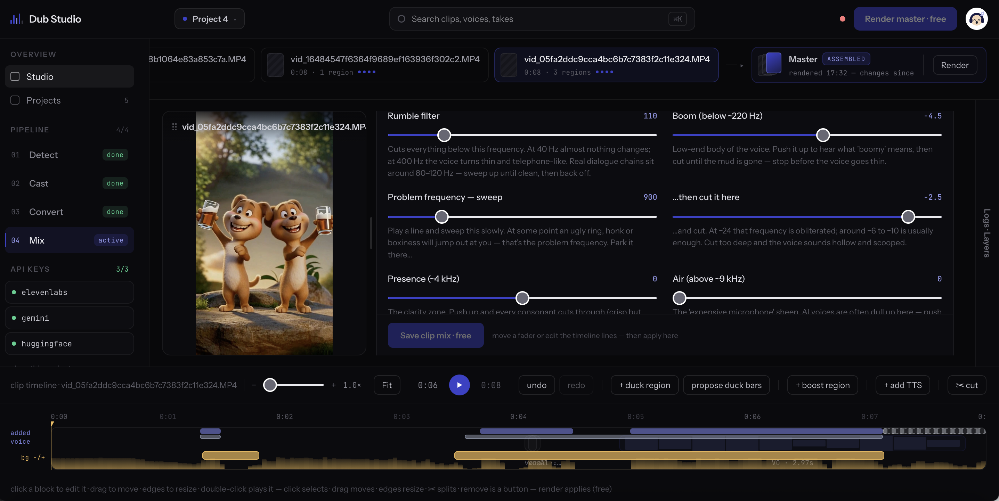
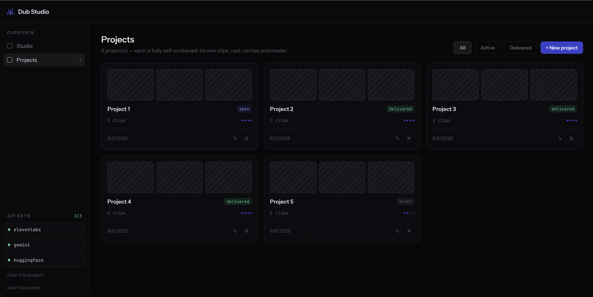
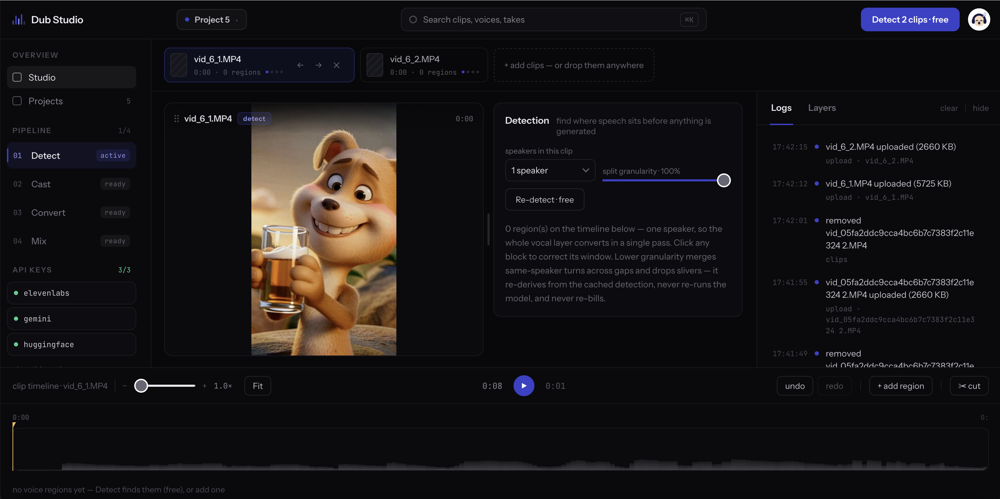
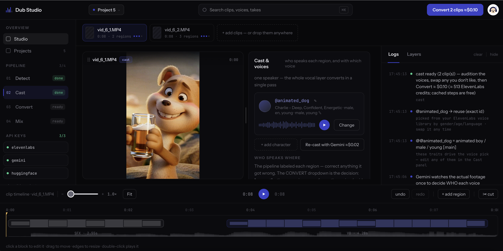
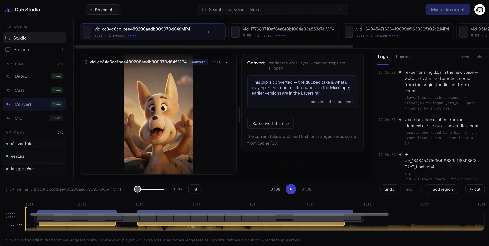

# Dub Studio

A local editor for cleaning up the sound of AI-generated videos. AI clips don't always sound like one
video: every clip casts a new voice, the loudness jumps between shots, and the cuts are audible.
Dub Studio replaces the voices with AI voices you choose, keeps each character's voice consistent
from clip to clip, keeps the original background sound underneath, and gives you the controls to
make the result sound professional.

It runs on your machine, in your browser, on your own API keys. Every step that costs money asks
first and shows the price. Everything else — detecting speech, editing, mixing, rendering — is
local, free, and repeatable.

**This is a first version and a work in progress.** I'm still learning how to build it well.
The next step is to stop borrowing the original background sound and instead build my own music,
ambience and effects — see [Taking it further](#taking-it-further).



## What it costs to use

You pay the AI providers directly — there is nothing to pay me.

| What | Provider | Cost |
|---|---|---|
| Replacing the voices | ElevenLabs | a few hundred credits per short clip — the free tier (10,000 credits/month) covers a real test run |
| Proposing who speaks | Gemini | ~$0.02 per clip, optional — you can cast by hand for free |
| Everything else (detect, separate, edit, mix, render) | your machine | free, unlimited |

The app never spends without asking: every paid run shows its price in a dialog first. Every paid
result is cached by its exact input, so repeating anything unchanged costs nothing — you only pay
again for what actually changed.

## How to use it

### Boot it up

```
git clone <this repo> && cd dub_studio
python3 -m venv .venv
.venv/bin/pip install -r requirements.txt
.venv/bin/python server.py        # -> http://localhost:8765
```

Python 3.11–3.13. ffmpeg is bundled — nothing else to install. The server binds to localhost only.

Then set your keys: paste them in the app (sidebar → API KEYS) or `cp .env.example .env` and fill
it in. The `.env` also picks the voice-separation model that runs locally:

- `ELEVENLABS_API_KEY` — the voice replacement. The key needs the `voices_read` permission.
- `GEMINI_API_KEY` — optional, only for automatic casting.
- `HF_TOKEN` — free Hugging Face read token; accept the terms once at
  [pyannote/speaker-diarization-community-1](https://huggingface.co/pyannote/speaker-diarization-community-1).
- `separation_model` — `mdx` (fast, default) or `roformer` (noticeably better, but heavier —
  ~600 MB one-time download and slower on each clip).

### 1. Make a project and drop your clips in



Each project is fully self-contained — its own clips, cast, caches and results. Drop in short
mp4 clips, a few seconds each.

### 2. Detect — when does someone speak? (free)



A local model finds the moments where a voice is present and puts them on the timeline. Drag,
resize, split or delete the regions if it got something wrong, or re-detect at a different
sensitivity — it's free. The first run downloads the local models once (a few minutes).

### 3. Cast — who speaks, in which voice? (~2¢ per clip, or free by hand)



Gemini watches each clip once and proposes the characters, so the same character keeps the same
voice in every clip. You can correct everything: reassign regions, rename characters, or skip
Gemini entirely and build the cast yourself. Audition and swap ElevenLabs voices any time — a
swap applies everywhere that character appears.

### 4. Convert — the paid step



The app shows what the run will cost and asks before starting. The original voice is isolated and
re-performed in the chosen voice — the words, timing and emotion of the original survive, because
nothing is transcribed. Every call and every cache hit shows up in the Logs as it happens, and
each re-convert archives the previous take instead of overwriting it.

### 5. Mix — make it sound right (free, endless)


The new voice sits on top, the original background underneath, turned down while the voice speaks (this is the "ducking" regions, which are generally unecessary when using the better voice separation models).
Every fader explains in plain words what it does and how to set it by ear. Duck or boost the
background exactly where you want on the timeline, cut pieces of the new voice, or generate a TTS
retake for a line. Mix the whole program at once or give one clip its own settings. Nothing here
ever re-bills — when it sounds right, render the master and download one stitched file.

## Under the hood, briefly

Detection is pyannote diarization (local). Casting is one Gemini call per clip. The voice is
extracted with ElevenLabs isolation and re-performed with speech-to-speech. A local separation
model splits the original audio so the background survives as its own layer, and the mixer holds
all dialogue at one loudness and ducks the background under each line by a measured amount. A
longer write-up on the how and the why is coming as an article.

## The presentation

There's a slide deck that tells the whole story — the problem, why the obvious shortcuts fail,
the six stages of the pipeline, and what it costs:
[`docs/presentation_standalone.html`](docs/presentation_standalone.html). It's one self-contained
file with the demo videos embedded, so download it and double-click — it opens in any browser,
no server needed. Press ↓ or space to move one idea at a time, ↑ to go back, and R to replay a
slide's animation.

## Taking it further

Two things this needs that I haven't solved — for anyone who wants to build on it:

**1. A cheap way to extract the vocal.** The vocal that gets re-voiced is extracted with
ElevenLabs isolation today, and that is most of the per-clip cost. A local extraction of the same
quality would make the tool nearly free to run.

**2. Build the background instead of borrowing it.** Today the tool keeps the original background
sound because it's easier. The goal is to build it instead: vision models identify the events that need
effects, the ambience that should carry across shots, and the music — then suggest a soundtrack
on the timeline that you tweak, piece by piece.
